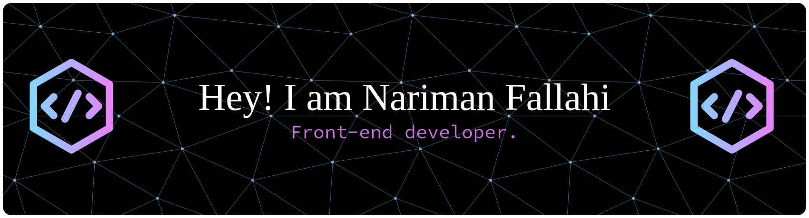

  

  <h2> ⚡ About Me </h2>
  
<b>Love programming and always working to get better! 🚀</b>

  <h2> 🛠 Skills & Technologies </h2>

<h3>Programming Languages</h3>

<h3>Frontend Technologies</h3>

<h3>Backend Technologies</h3>

<h3>Database</h3>

<h3>Mobile App technologies</h3>

<h3>Other technologies</h3>

  <h2>
    📩 Let's Connect
  </h2>

  <h2>
    📊 GitHub Analytics
  </h2>

 

  

 

